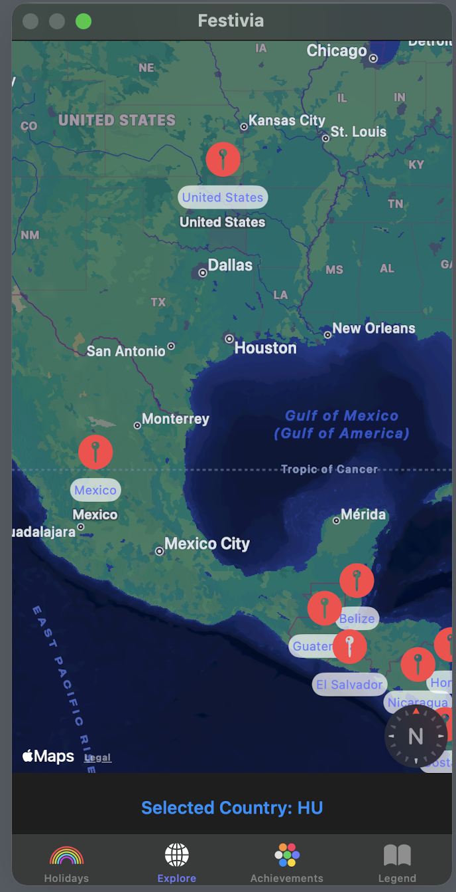
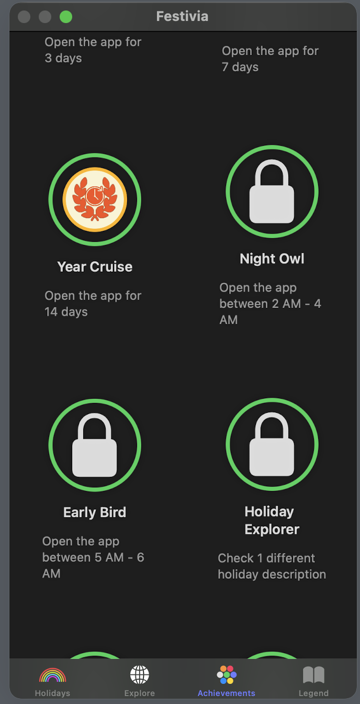
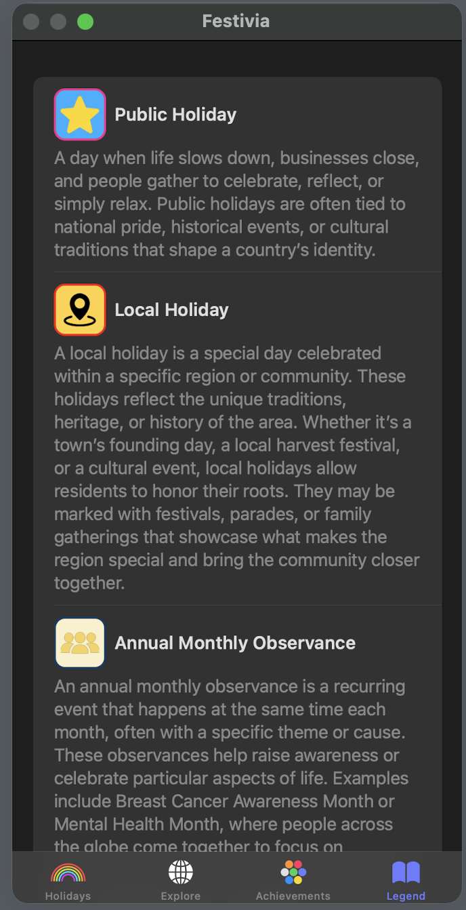

  

# 🎉 Festivia

**Festivia** is an iOS app that lets you explore holidays from countries all around the world — all in one simple, beautifully designed experience.

Discover public holidays, learn their meaning, and see how different cultures celebrate important dates. Whether you’re curious about global traditions, planning travel, or just exploring the calendar beyond your own country, Festivia makes it easy and enjoyable.

---

## ✨ Features

- 🌍 Explore public holidays from countries worldwide  
- 🗺️ Select countries directly on **Apple Maps** using interactive pins  
- 📅 Browse holidays by country and date  
- 📖 Learn more about each holiday with one tap  
- 🏆 Unlock **achievements** as you explore holidays  
- 🎨 Clean, native iOS interface built with **SwiftUI**

---

## 🛠️ Technology & Architecture

- **Language:** Swift  
- **UI Framework:** SwiftUI  
- **Data Source:**  
  - Uses the **Holidays API** by API Ninjas  
    👉 https://api-ninjas.com/api/holidays
- **Maps:**  
  - Apple Maps with pins to visually select countries
- **Persistence:**  
  - `UserDefaults` for storing achievement progress
- **External Links:**  
  - Attempts to open a **Wikipedia page** for detailed holiday information  
  - If unavailable, automatically opens a **Google search** for the holiday name

---

## 🏆 Background

- Built using **Swift Playgrounds**
- Created for the **Apple Developer Challenge 2025**
- Designed with a strong focus on exploration, education, and usability

---

## 📸 Screenshots

  

  

  

  

## Watch the video demonstration

  

